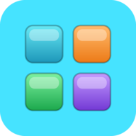

<p align="center">
  
</p>

# Block Blast

A self-contained Block Blast clone — drag pieces onto an 8×8 grid, fill rows and columns to clear them, chase combos and streaks. Built as a single `index.html` with no build step, no server, and no network calls after the first page load.

**Play it now:** [https://tcottrill.github.io/myBlockBlast/](https://tcottrill.github.io/myBlockBlast/)

The whole game — markup, CSS, JavaScript, tile rendering, and synthesized sound effects — lives inside one HTML file. The only sidecar files are the PWA icons and the web app manifest.

## Free and open

Released into the **public domain** under the [Unlicense](LICENSE). 100% free:

- No purchase, subscription, or in-app payment.
- No ads, no trackers, no analytics.
- No account or sign-in.
- No network calls — once the page is loaded, the game runs entirely on your device.

You may copy, modify, redistribute, or sell it for any purpose.

## How to play

1. Three pieces appear in the tray at the bottom.
2. Drag a piece onto the grid. A floating preview rides about 80 px above your finger so you can see what you are placing. A green outline means the piece fits; red means it does not.
3. Release on a valid spot to drop the piece. Release outside the grid (or on an invalid spot) and the piece snaps back to the tray.
4. Whenever a row **or** a column is completely filled, those eight tiles shatter and you score.
5. When all three tray pieces have been placed, three fresh pieces appear.
6. The game ends when none of the remaining tray pieces can fit anywhere on the board.

### Scoring

- **+1** for each tile placed.
- **+10** for each line cleared.
- **Combo bonus** when one placement clears more than one line: `+10 × (lines − 1) × lines`. So 2 lines → +20, 3 lines → +60, 4 lines → +120.
- **Streak bonus** when consecutive placements each clear at least one line: `+5 × streak`. The streak resets the moment you make a placement that does not clear anything.

There is no undo — every placement is committed. Plan ahead.

## Install on your phone

The game is a Progressive Web App. Once it is hosted over HTTPS (for example on GitHub Pages), you can install it to your home screen and play full-screen.

- **iPhone / iPad (Safari)** — open the site in Safari, tap the **Share** button, then **Add to Home Screen**.
- **Android (Chrome)** — open the site, tap the three-dot menu, then **Install app** (or **Add to Home Screen**).
- **Desktop (Chrome / Edge)** — click the install icon in the address bar.

Once installed, the app runs full-screen with no browser chrome and works offline.

## File inventory

```
myBlockBlast/
├── index.html                       # entire app
├── site.webmanifest                 # PWA manifest
├── icon-master.svg                  # vector source for icons
├── icon-192.png                     # PWA icon
├── icon-512.png                     # PWA icon
├── apple-touch-icon.png             # iOS home-screen icon (180×180)
├── apple-touch-icon-167x167.png
├── apple-touch-icon-152x152.png
├── favicon.ico
├── favicon-16x16.png
├── favicon-32x32.png
├── README.md                        # this file
├── PROMPT.md                        # regeneration spec
└── LICENSE                          # Unlicense
```

## Running locally

The game is a single static file. Open `index.html` directly in any modern browser — no server required:

```sh
# Windows
start index.html

# macOS
open index.html

# Linux
xdg-open index.html
```

For PWA install testing you need HTTPS, which `file://` and plain `http://` cannot provide. Deploy to GitHub Pages or any static host.

## Regenerating from a prompt

`PROMPT.md` is a self-contained brief for the project. Paste it into [claude.ai](https://claude.ai) — or any capable LLM — and you should get back a working single-file implementation that matches this repository.

## Credits

Inspired by the mobile game **Block Blast!**. This is an independent open-source homage; it shares no code, art, or copyrighted material with the original.

### Contributors

- **tcottrill** — project owner, direction, and review.
- **Claude (Anthropic)** — co-author of the design spec and the initial implementation.

## License

[Unlicense](LICENSE) — public domain.
